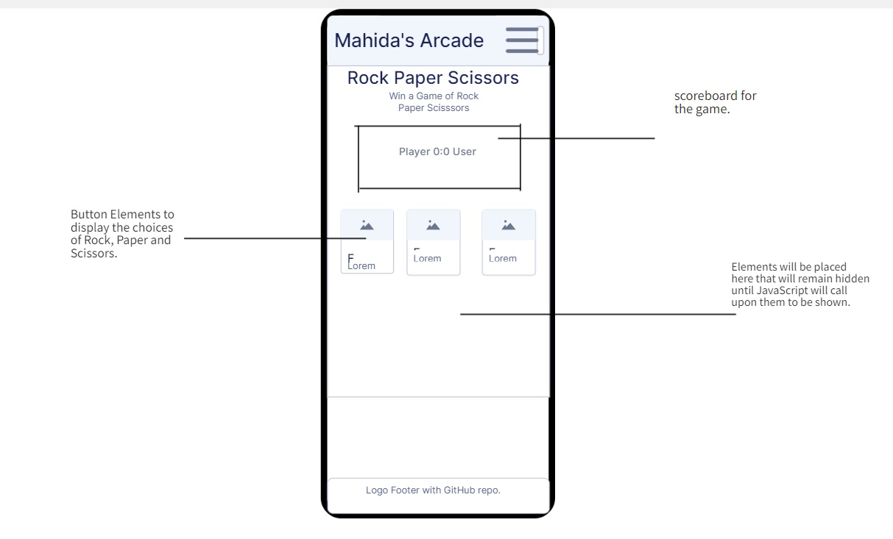
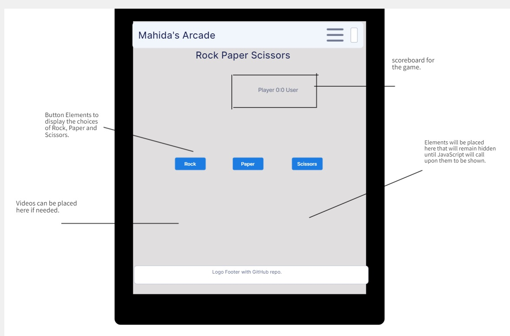
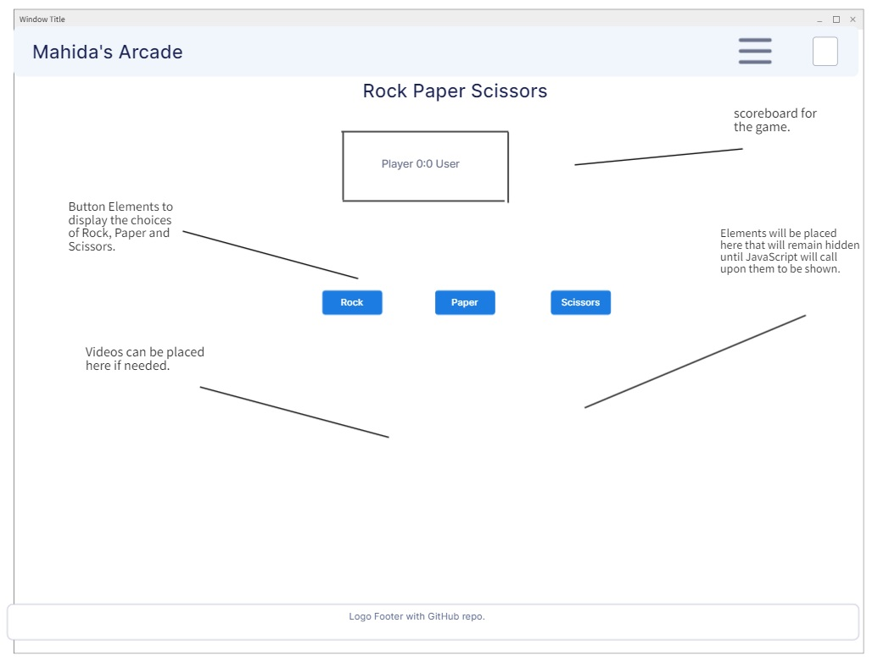

# MAHIDA'S ARCADE: Rock Paper Scissors

This project is designed to create a fun interactive Rock Paper Scissors game with a fully functioning program that can make it's own choices and possibly best you in a game of chance (Rock Paper Scissors.) Throughout the development of this project from it's inception to it's latest version; the key has always been to demonstrate a complex level of JavaScript through the manipulation of the DOM. The complexity of the JavaScript in this project goes beyond just creating a function for the game to be played... it looks for ways to make the screen more interactible, fun and convenient for the user using the site. 

This page contains a single webpage called :
- index.html / **This webpage contains the Rock Paper Scissors game and all of the elements that are manipulated and used by JavaScript.**

 ## Table of Contents

Click here for the Table of Contents

- [Mockup Screenshots](#mockup-screenshots)
- [Wireframes](#wireframes)
- [Features](#features)
- [User Stories](#user-stories)
- [UX](#ux)
- [Tools & Technologies](#tools--technologies)
- [Testing](#testing)
- [Deployment](#deployment)
- [Credits](#credits)
- [Acknowledgements](#acknowledgements)

## Mockup Screenshots

## Wireframes
- The wireframes for this project were created before the projects inception. 
- They are a rough blueprint on how the site should look with the elements and text-arrows pointing to what will be included within the space.

### Mobile Wireframes
| index.html |
| :---: | 
|  |

### Tablet Wireframes
| index.html |
| :---: | 
|  | 

### Desktop Wireframes
| index.html |  
| :---: | 
|  | 

- The structure and look of the website has been significantly improved on from the project planning inception in these wireframes to now at the deployed site. 
- There were many additions that can be seen in the live site from these with one notably being the user and computer display. Which showcases what both the player and computer chose to give better ux and showcase the projects functionality. 

## Features

### Future Features

- In the future there are definelty many ways for me to return to this project and create more complexity and improve on the nature of the interactiability.
- For example, I would like to add more transitions and manipulate the DOM on certain elements to add highly detailed animations.
- I would like to add a home page that is detailed and has it's own identity so it doesn't feel like just any Rock Paper Scissors game.

## User Stories
1. As a new user, I want to be able to play a functioning game of Rock, Paper Scissors.
2. As a new user, I want to know the rules behind playing Rock Paper Scissors
3. As a new user, I want to have a chance to replay the game if I wanted to on the site.
4. As a new user, I want to know why I won and why the computer has lost with our options displayed.
5. As a new user, I want there to be a difference in the display of the site whether or not I win or lose.

## UX
[Include information about the user experience aspects of your project]
- The design for this project started through wireframing and viewing material that is focused on making interactive JavaScript projects. 
- The wireframing of this project, helped me create the base structure of the site with the header being everpresent and the footer element to give the website a professional look.
- The stylistic apporach to this project was planned ahead of time before the projects inception period. The goal was to make a program-esque aestethic with the use of color and very specifically the font used for the project.
- The navigation was going to be non-existent for the page as it is just a Rock Paper Scissors game on a single page. The header therefore needed something to occupy the plethora of space within it. A button was used to display hidden content crucial to the game and UX.

### Color Scheme 
- The use of color in this project with all honesty, wasn't intended to be a focal point. The idea behind the project initially was to have a "program-esque" look akin to common depictions of code with the colors black and white. However, through working and developing the project and the elements within it, that thought regressed and color slowly oozed it's way into the project. 
- The use of color in this project is quite minimal but effective in both it's style and within the user experience that goes behind setting the color as intended which will be explained below. 
- Although, color was minimal it can commonaly be seen used to create a division in elements, a division in sides, a division in choices and a divison in score.
- The colors that were used are:-

- `black` this color was used to create that oldschool program look for the Rock Paper Scissors game. It was intended to make it feel and breath "retro".

- `green` this color was specifically used to create a division between the player/user and the computer. The color green is normally is signified in motifs of self and ownership. This provided a stark contrast between the other color selected to signify the other end of the division; the computer.

- `#b20000` this color as stated signifies the divison between the player and computer. The color red normally is showcased as a color of opposition, uncertainty and danger which is why it was used to create this battle ground visage that can be seen in the scoreboard with the player used having the color green on their side whilst the computer used a blood red showcasing it's an enemy that you need to defeat in "Mahida's Arcade Rock, Paper, Scissors.".

- `darkgrey` this color was also used in the site to give a monochrome styling to the page as sometimes every element being just black can be quite unengaging. This color was therefore used to counter this possibility and give off a more creative look. 

- `cyan` was used as a color in the box-shadow. The reason for using this color was that it's simply very out there against all of the colors that are used in the site. It attempts to catch the eye of the user and be transportitive to a very arcade like scene. 

Click this for a Coolers screenshot

  

### Typography 

- This project uses only one font primarily and that is "monospace". This was a creative decision to give the screen once again a "program-esque" look to it. Additionally, it helps sell the idea of "Mahida's Arcade" as the font itself feels extremely arcade like due to the use of spacing between the letters akin to an old school game or a computer terminal. 
- In additon, the font is extremely clear to read as the spacing gives letters much more room to breathe allowing users to better follow the text content in a quicker more sophisticated manner.

- However, there is another font that can be seen although it can only be seen once in the header for "Mahida's Arcade". This font is Georgia, 'Times New Roman', Times, serif;. 
This font was chosen as it looked big and it made the letters really stand out with the width of them.

## Tools & Technologies 

- [HTML](https://en.wikipedia.org/wiki/HTML) used for the content of the site.
- [CSS](https://en.wikipedia.org/wiki/CSS) used to style the html that it within the site.
- [JavaScript](https://en.wikipedia.org/wiki/JavaScript) used to create the functionality of the site.
- [CSS Flexbox](https://www.w3schools.com/css/css3_flexbox.asp) used to give the website a responsive design.
- [Git](https://git-scm.com/) used to control the site via "git add, git commit -m, git push" and etc.
- [GitHub](https://github.com/) was used to store my code and access my project repository through the web. 
- [GitHub Pages](https://pages.github.com/) was used to deploy my site and make it live for everybody to see.
- [Favicon.cc](https://www.favicon.cc/) was used to create the sites favicon.
- [VScode](https://code.visualstudio.com/) used as an IDE through GitPod.
- [Gitpod](https://www.gitpod.io/) used as the IDE to work and code the site. Gitpod Enterprise was used.

## Testing
 
 Please refer to the [TESTING.md](TESTING.md) file to see the testing of the website.

 ### Deployment

- This website was deployed via GitHub's, GitHub Pages. 
- For anybody that is viewing this README.md file and is looking to find out how to deploy the site then please follow these instructions.
- As soon as you are within the [GitHub repository](https://github.com/mahidaCodeTrained/rockpaperscissors) please go through the navigation tab until you come across the settings for the repository. 
- Within the settings there is a segment that is called Pages.
- Once you locate and click on "Pages", you must selected the main branch under the build and deployment for the site. 
- As soon as you have clicked these and then save, the site will be deployed via GitHub Pages. A simple refresh of the page should showcase that GitHub pages is working in the deployment of your site. 

-  The live page to this project can be found [here](https://mahidacodetrained.github.io/rockpaperscissors/)

### Local Deployment 

- This project can be saved and stored into your local device via forking or cloning.

### Cloning 

This repository can be cloned by following these steps.

1. Go to the [GitHub repository](https://github.com/mahidaCodeTrained/rockpaperscissors) for the project.
2. There should be a code button telling you if you would like to clone this project. It will be next to the add files button.
3. It should tell you if you would like to clone via. HTTPS, SSH or a GitHub CLI, once you have decided what you want to use to clone the repository then click the copy button to copy the url of the project.
4. Open Git Bash or a Terminal
5. Once inside, change the working directory to the one where you want the cloned directory that you have copied from the GitHub repository.
6. In the IDE terminal, you can now clone my rock paper scissors repository by inputting this command:
   - `git clone https://github.com/mahidaCodeTrained/rockpaperscissors`

## Credits 

##  Acknowledgements
- I would like to thank my Code Institute mentor [Alan Bushell] (https://github.com/Alan-Bushell)
- I would like to thank the Code Institue [slack community] (https://code-institute-room.slack.com)
- I would like to thank my family for helping support me through my second project and constantly checking my page.
