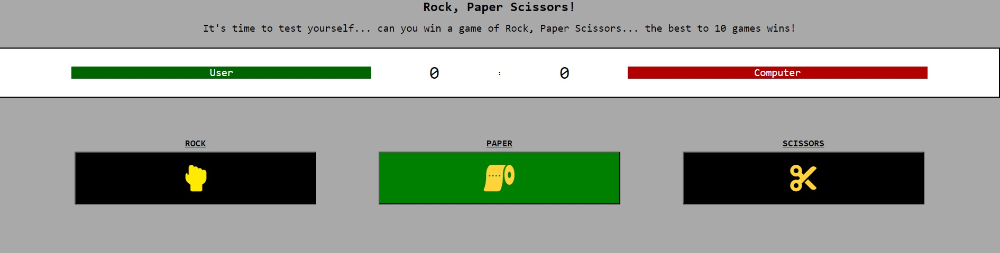
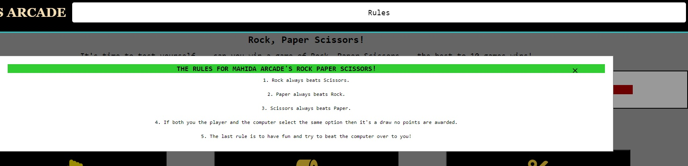

# Testing

Return to the [README.md](README.md) file.

## Table of Contents

Click here for Table of Contents

- [Validation](#validation)
  - [HTML](#html)
  - [CSS](#css)
  - [JavaScript](#javascript)
  
- [Browser Compatibility](#browser-compatibility)

- [Responsiveness](#responsiveness)

- [Lighthouse](#lighthouse)

- [User Story Testing](#user-story-testing)

- [Manual Testing](#manual-testing)

- [Bugs](#bugs)

## Validation

### HTML

- The W3C Markup Validator checks the markup validity of websites to see if there is any error in the coding of the website. It is a crucial tool to use to know if the site is completely validated with no errors.
- HTML on every page was checked alongside the CSS of the site. 

| Page | W3C URL | Screenshot | Notes |
| :---: | :---: | :---: | :---: |
| index.html | [W3C](https://validator.w3.org/nu/?doc=https%3A%2F%2Fmahidacodetrained.github.io%2Frockpaperscissors%2F) |  | Passed all checks |

### CSS
| Page | Jigsaw URL | Screenshot | Notes |
| :---: | :---: | :---: | :---: |
| style.css | [Jigsaw](https://jigsaw.w3.org/css-validator/validator?uri=https%3A%2F%2Fmahidacodetrained.github.io%2Frockpaperscissors%2F&profile=css3svg&usermedium=all&warning=1&vextwarning=&lang=en) |  | Passed all checks |

### JavaScript
| Page | JS Hint URL | Screenshot | Notes |
| :---: | :---: | :---: | :---: |
| script.js | [JS Hint](https://jshint.com/) |  | This has passed all checks, the two unused functions that can be seen stated are not an error in the JS code. It is simply because those functions are not being called upon at the current moment. |

## Browser Compatibility

- In order to absolutely make sure that the site is running well we will need to dive into different search engines and find out for ourselves just how it looks.
- This is important to do because some browsers tend not to work and function as you would normally expect them to. 
- Therefore, browser compatibility is great to find out if anybody is facing any issues on the sites so bugs can be raised.

| Engine | Screenshot | Comments |
| :---: | :---: | :---: |
| Chrome |  | Looks Good on Chrome |
| Firefox |  | Looks Good on Firefox |
| Microsoft Edge |  | Looks Good on Edge |

## Responsiveness
- "Mahida's Arcade: Rock Paper Scissors" looks good on all screen sizes and all devices through the use of percentages as a way to position and size elements. 
- The site didn't need many if any media queries at all as the content within the page is minimal as the JavaScript was the main focus of the project.
- The media queries that do exist ust are focused on sizing text content so they appear more readable for the user.
- CSS Flexbox was used to achieve a great responsiveness.

- To check the responsiveness of the website you can follow these steps:
1. Go to the [live site](https://mahidacodetrained.github.io/rockpaperscissors/) and right cick with your mouse on the screen.
2. Once you have right clicked you will see a menu. Find Inspect Element.
3. Once you have found inspect element you will see responsive design on the top of the page.
4. This is where you can now scroll and drag the site to see how it looks like on different screen sizes.

## Lighthouse 
| Page | Mobile | Desktop | Notes |
| :---: | :---: | :---: | :---: |
| index.html |  |  | The site is running absolutely perfectly with 100's across the board. This is even with high quality videos added into the file. The accessibility is 100 meaning it will provide a user experience that is not difficult but clear. |

## User Story Testing 

| User Story | Screenshot |
| :---: | :---: |
| As a new user, I want to be able to play a functioning game of Rock, Paper Scissors. |  |
| As a new user, I want to know the rules behind playing Rock Paper Scissors. |  |
| As a new user, I want to have a chance to replay the game if I wanted to on the site. |  |
| As a new user, I want to know why I won and why the computer has lost with our options displayed.|  |
| As a new user, I want there to be a difference in the display of the site whether or not I win or lose. |   |
| As a new user, I want to clearly see what my score is against the computers score.|  |

## Manual Testing

| Test | Result |
|--|--|
|When rock is selected then the player choice shows rock.| Pass |
|When paper is selected the player choice shows paper|Pass|
|When scissors is selected the player choice shows scissors|Pass|
|The rules modal in the header will close once you click the X on it's screen|Pass|
|The rules modal closes when the user clicks outside of the screen|Pass|
|When the game starts the computer and players options are presented correctly.|Pass|
|When the game starts the scoreboard works and increments the score by 1 depending on whether you win or lose|Pass|
|When the user wins the winning video is presented and no longer hidden|Pass|
|When the user loses the losing video is presented and no longer hidden|Pass|
|The videos are all on mute|Pass|
|The correct video is presented and dont overlap.|Pass|
|When the user clicks on the reset button it scrolls up to the top of the page ready for another match.|Pass|
|When the user clicks on the reset button the video elements are hidden and the choices are brought back.|Pass|
|The user can click on the reset button and the entire game will reset from 0|Pass|

## Bugs
- I've encountered no bugs in this live site. It is working and performing as expected with 100% efficiency. The site before it's "final version" had a bug where both hidden videos would play and overlap on top of eachother when the choices buttons were spammed excessively during the transition for the object itself to become hidden via JavaScript.